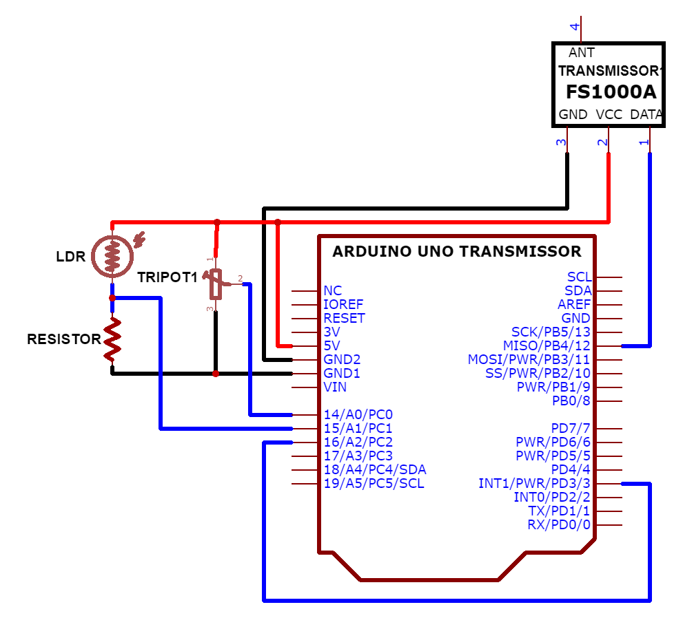
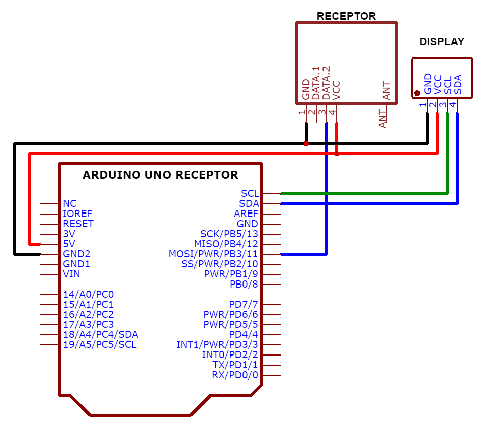

# Osciloscópio Remoto
> Projeto desenvolvido para conclusão do curso de Arduino oferecido pelo InovUERJ durante o proejto INTEGRA

## Descrição
> Um Arduino Uno monitora suas entradas analógicas e por meio de uma comunicação sem fio utilizando o transmissor [FS1000A](https://cdn-reichelt.de/documents/datenblatt/FS1000A_DB_DE.pdf "Datasheet Transmissor 433MHz") envia para outro Arduino Uno, que apresenta um gráfico dos valores recebidos na [tela OLED de 128x32 pixels](https://www.rajguruelectronics.com/Product/1145/OLED%204%20Pin%20128x64%20Display%20module%200.96%20inch%20blue%20color.pdf "Tela OLED 128x32pixels").
> 
> Os valores das entradas analógicas e as mensagens enviadas e recebidas são transformadas no formato JSON e são enviadas para a saída serial, assim é possível utilizar o computador para também apresentar os gráficos das saídas analógicas.

## Transmissor
> Captura os valores analógicos das entradas A0, A1 e A2 periodicamente. Na entrada A0 foi conectado um trimpot (resistor variável) de 10K&Omega;, a entrada A1 foi conectado um LDR (sensor de luminosidade) e a entrada A2 foi conectada diretamente a saída digital 3 com função PWM.
> 
> O LDR é um sensor que funcina de forma analógica, assim o trimpot e o LDR foram escolhidos por apresentarem valores analógicos a serem lidos pelas entradas analógicas.
> 
> É enviado um sinal PWM para a saída digital 3 variando de 0 a 100, para visualização da mudança do dutycycle. A saída PWM foi conectada diretamente a entrada analógica A2, assim é possível verificar a mudança do dutycycle.
> 
> A cada captura das entradas analógicas os valores obtidos são transmitidos juntos numa mensagem única com 2bytes para cada valor analógico obtido, sendo assim são transmitidos 6bytes na seguinte sequência: A0, A1 e A2. 
> 
> ### Esquema de Ligação
> 
>

## Receptor
> Recebe os valores analógicos das entraddas A0, A1 e A2 transmitidos por rádio frequência. Mantém esses valores salvos para a apresentação do gráfico na tela OLED.
> 
> Devido ao tamanho da tela e para evitar a sobreposição dos gráficos de cada canal analógico, os gráficos são apresentados um de cada vez. Além disso, os gráficos são apresentados com valores digitais e em volts. Primeiro são apresentados os três gráficos com valores digitais e depois os mesmos três gráficos convertidos para volts, com intervalo de 10 segundos entre cada gráfico.
> 
> ### Esquema de Ligação
> 
