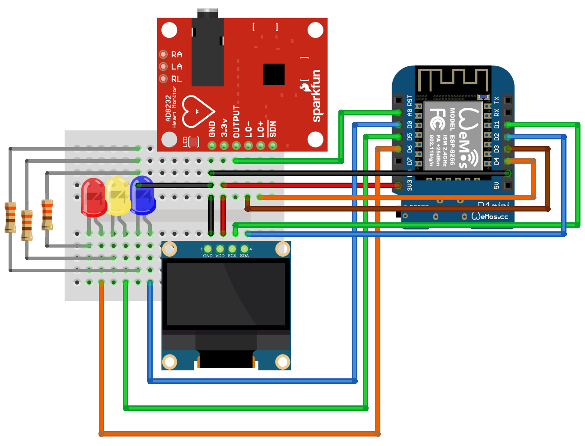
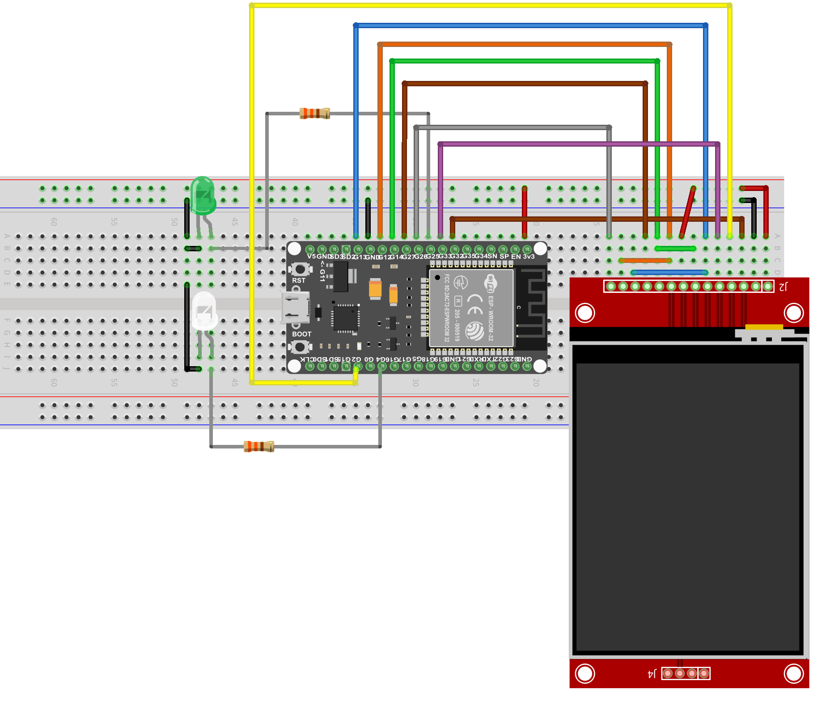

# Projeto ECG Remoto

O ECG Remoto é composto por dois componentes principais: [transmissor](#trasmissor) para coletar os dados cardíacos utilizando um sensor cardíaco e [receptor](#receptor) que recebe os dados coletados pelo transmissor e os apresenta graficamente em visor colorido.

## Trasmissor

O transmissor é composto por pelo sensor de batimentos cardícos [AD8232 Heart Monitor](./documents/ad8232_datasheet.pdf), um conjunto de LEDs indicativos e um chip ESP para controlar e enviar os dados pela rede. O esquema de ligação pode ser visualizado na [Figura 1](#figura-1).

### Figura 1 - Esquema de ligação do transmissor

## Receptor

O receptor é composto por um chip ESP para receber os dados enviados pelo transmissor, os apresentar graficamente no visor [TFT 2.4" 240x320 pixels TouchScreen com leitor SDCard e Comunicação SPI](./documents/2.4_spi_tft_toutch_sdcard.pdf), enviar para a núvem utilizando o protocolo [MQTT](https://datatracker.ietf.org/doc/html/rfc9431) e [HTTP](https://datatracker.ietf.org/doc/html/rfc2616), atuando como servidor Web. O esquema de ligação pode ser visualizado na [Figura 2](#figura-2).

### Figura 2 - Esquema de ligação do receptor

